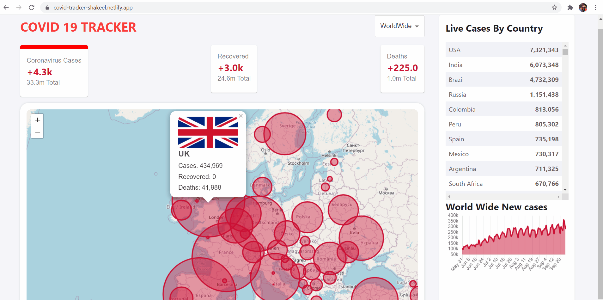

# COVID Tracker Application in React JS ⚡️

## A real time application which gives stats about covid situation around globe!



#### Application is Live here [Netlity Link](https://covid-tracker-shakeel.netlify.app/)

## Sections

✔️ Map with countries cases details Popup\
✔️ List of all countries with total cases\
✔️ Drop Down to view cases stats for specific country\
✔️ Graph to show covid cases trend in last 3 months\
✔️ Fully mobile responsive CSS flexbox layout\
To view a live example, [click here](https://covid-tracker-shakeel.netlify.app/)

## Technologies

✔️ React JS for front end\
✔️ Material UI for UI components styling etc\
✔️ disease.sh APIs to fetch real time stats about covid cases\
✔️ Open source map for showing map with circles.\
✔️ Chart JS 2 to show cases trends line graph.\

## Getting Started 🚀

### Install ⚙️

The application has module dependencies which can be installed by

```
npm install / yarn install
```

### Start 🏃

```
npm run start
```

### Build 😷

```
npm run build
```
